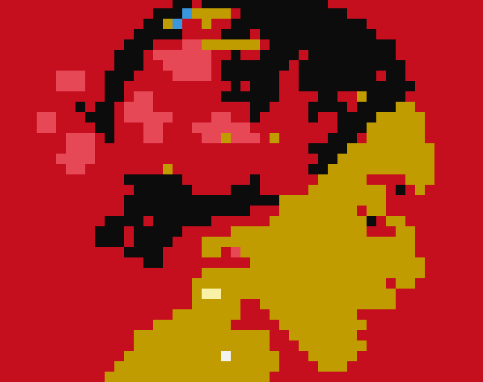

# console-printer

Log images to the console using Java on the Eclipse IDE

Hey Guys, so here's some of my attempts at printing images to console. These are just some of the techniques that you could use to output images onto the console.

So far I have come up with three techniques to output images onto the console:

1) ImageToConsoleBW - Maps each pixel of the image to the closest amongst the following colors - white, light grey, dark grey and black. 
The closest matching colors are then mapped to a set of 4 respective characters. The image is then output as an array of characters onto the console.
This technique is very fast but the image output is only in black and white.

2) ImageToConsole - Maps each pixel of the image to the closest among pre defined ANSII color codes and then outputs the ANSI codes onto the screen.
This image is extremely slow and the user is warned to scale the image down to a small size before outputting to the console. However,
the image is in color and there's a lot of scope for improvement of the code. ( You may have to set up ANSI console
separately on a few IDEs)

3) RubiksTechnique - This technique was inspired by Rubiks art that is quite popular online, wherein people make realisitc art using the faces of rubiks cubes as
pixels. In this technique the image is mapped onto n different random colors ( 6 is the defaul analogous to the rubiks cube) and is output onto the screen. This 
technique too is. A sub technique was then later devloped for the RubiksTechnique which allowed using the same code to print out the image as a 2D array of n 
different characters.

PS: The code is still being developed on and was meant to be used as a reference for you to build on or take inspiration from such techniques. Also do check out the 
AnimationToConsole technique which was an attempt at running an animation on the Java Console. 
